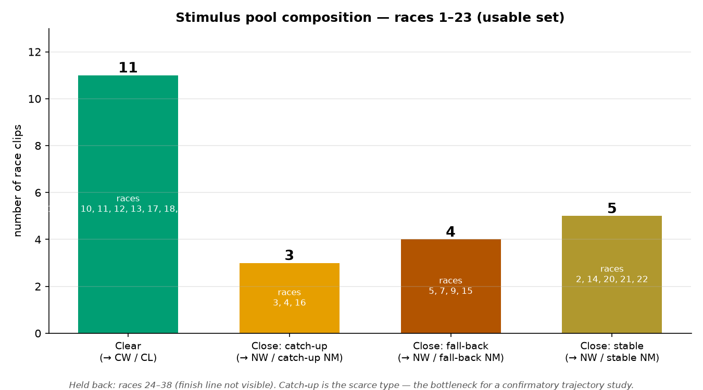

# Stimuli — greyhound race clips

## Source

39 clips from the 2013 Cambridge study (Kate Champion Part II project; raters
Luke Clark, Kate Champion, Yin Wu). Real UK greyhound races, ~20–27 s each. The
original `.avi` files were converted to browser-ready H.264 `.mp4` (854×480); the
originals are archived untouched.

## Usable set

We use **races 1–23**. These end on the result board (1st/2nd/3rd traps + race
time visible), so the finish is verifiable. Races 24–38 cut off *before* the line,
so they are held back until their finishing order can be identified. `test.avi` is
the practice clip.

Standard UK trap jackets (1 red, 2 blue, 3 white, 4 black, 5 orange, 6 black/white
stripes) let a participant track their assigned dog. Five races ran with a vacant
trap (5 dogs): races 2, 10, 16, 19, 22 — the task offers only the dogs that
actually ran on those trials. Finishing order comes from the 2013 result sheets,
cross-checked against the scoreboard shown at the end of each clip.

## How a clip becomes a condition

Each clip is experienced from the point of view of the participant's secretly
assigned trap:

- clear race, assigned the winner → **clear win (CW)**
- clear race, assigned a back dog → **clear loss (CL)**
- close race, assigned the winner → **narrow win (NW)**
- close race, assigned the runner-up → **near miss (NM)**

So one close clip yields *both* a narrow win and a near miss depending on
assignment — NW and NM are the same footage seen from the two lead dogs.

## How the clear-vs-close labels were decided

1. **2013 coding.** The original team coded event type (winner's perspective) plus
   a "Distance" column — the finishing time-gap between 1st and 2nd, in seconds —
   and defined a *narrow win* as 2nd within 0.09 s and a *clear win* as 2nd more
   than 0.26 s. About half the pool fell in the undefined 0.09–0.26 s middle, and
   the consensus column was left blank for most races, so the 2013 classification
   was never completed.

2. **Why we didn't classify from that gap.** The gap is derived from race *times*,
   not visible closeness; checked against the footage it didn't track how close the
   finish *looked* (in places it behaved more like a 2nd-to-3rd gap). It is kept
   only as a continuous covariate, not the classifier.

3. **Eye-coding (Omar).** Each of the 23 finishes was judged by eye as **clear win
   vs close/narrow** — the axis that actually determines whether the runner-up
   experiences a near miss. Result: **11 clear, 12 close.**

4. **Agreement with 2013.** The eye split matches the 2013 raters' consensus on
   **20 of 23** races. Two races (3, 20) had no 2013 consensus to compare against.
   **Exactly one race disagrees — race 18** — read as a clear win by eye but coded
   stable/narrow in 2013 (and only 2 of 3 raters agreed even then). Race 7 was an
   initial disagreement, but on re-watch it was a genuine photo finish and was
   corrected to *close*, bringing it into line with 2013.

## Trajectory sub-coding (exploratory)

For the fall-back vs catch-up question, the close clips carry a finer label —
**fall-back** (led, caught at the line), **catch-up** (closing, fell just short),
or **stable** (close throughout). Coded from the 2013 event-type notes plus a
partial re-view. Catch-up is scarce (~3 clean races), so the trajectory split is
exploratory and is the main motivation for sourcing more footage in a follow-up.

## Pool composition (races 1–23)

- **Clear: 11** (races 1, 6, 8, 10, 11, 12, 13, 17, 18, 19, 23) → supply CW and CL
- **Close: catch-up: 3** (races 3, 4, 16) → NW + catch-up NM
- **Close: fall-back: 4** (races 5, 7, 9, 15) → NW + fall-back NM
- **Close: stable: 5** (races 2, 14, 20, 21, 22) → NW + stable NM

Catch-up is the scarce type — the bottleneck for a confirmatory trajectory study.
Races 24–38 are held back (finish line not visible on the clip).

## Per-race table

`kind`: clear/close by eye. `2013`: derived from the original raters
(clear / close / no-consensus). `agree`: eye vs 2013. `trajectory`: for close
races only. Finishing order shown as winner/2nd/3rd trap.

| race | runners | order (1/2/3) | kind (eye) | 2013 | agree | trajectory |
|---|---|---|---|---|---|---|
| 1 | 6 | 1/4/2 | clear | clear | ✓ | — |
| 2 | 5 (no 4) | 3/2/1 | close | close | ✓ | stable |
| 3 | 6 | 3/4/5 | close | no-consensus | — | catch-up |
| 4 | 6 | 3/5/2 | close | close | ✓ | catch-up |
| 5 | 6 | 2/3/1 | close | close | ✓ | fall-back |
| 6 | 6 | 6/3/5 | clear | clear | ✓ | — |
| 7 | 6 | 6/2/3 | close | close | ✓ | fall-back |
| 8 | 6 | 6/1/3 | clear | clear | ✓ | — |
| 9 | 6 | 4/1/2 | close | close | ✓ | fall-back |
| 10 | 5 (no 6) | 1/3/4 | clear | clear | ✓ | — |
| 11 | 6 | 4/1/2 | clear | clear | ✓ | — |
| 12 | 6 | 6/3/5 | clear | clear | ✓ | — |
| 13 | 6 | 2/1/3 | clear | clear | ✓ | — |
| 14 | 6 | 4/6/5 | close | close | ✓ | stable |
| 15 | 6 | 1/3/4 | close | close | ✓ | fall-back |
| 16 | 5 (no 2) | 6/3/1 | close | close | ✓ | catch-up |
| 17 | 6 | 5/2/6 | clear | clear | ✓ | — |
| 18 | 6 | 4/6/5 | clear | close | ✗ (only diff) | — |
| 19 | 5 (no 6) | 1/3/4 | clear | clear | ✓ | — |
| 20 | 6 | 1/4/5 | close | no-consensus | — | stable |
| 21 | 6 | 3/1/4 | close | close | ✓ | stable |
| 22 | 5 (no 6) | 3/5/4 | close | close | ✓ | stable |
| 23 | 6 | 3/5/1 | clear | clear | ✓ | — |
